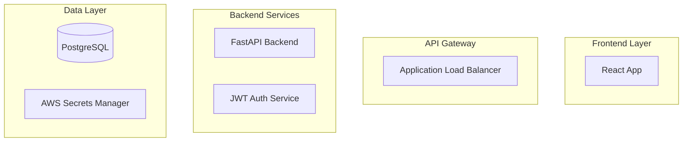
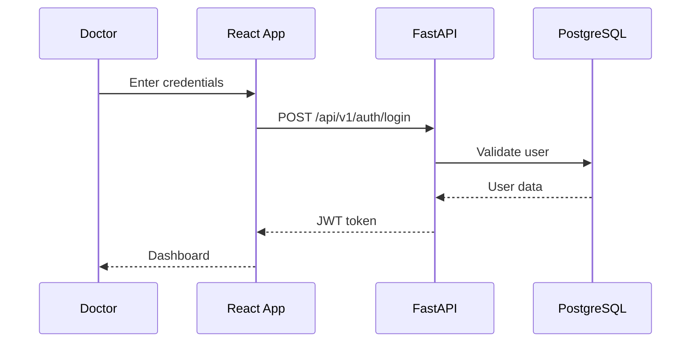

# Specification-Driven Application Design & Implementation

## Overview

Specification-driven development is a methodology where applications are built from formal specifications that serve as both documentation and executable contracts. Your HealthCare SaaS project demonstrates this approach through layered specifications that guide implementation, testing, and deployment.

## Project URL on AWS

[HealthCare SaaS Application](https://d38vpnbis6nxp0.cloudfront.net "A Multi-Tenant Healthcare Portal")

### Credentials to login to the portal:
 - You can reach me to get the Doctor and Patient login credentials at: [Gopi Krishna Peteti](mailto:petetijobs@yahoo.com)

## Core Principles

### 1. Single Source of Truth
Specifications are the authoritative source for:
- API contracts (OpenAPI/Swagger)
- Database schemas (SQLAlchemy models)
- Business rules (Service layer specifications)
- Deployment architecture (Infrastructure as Code)
- User workflows (Sequence diagrams)

### 2. Layered Specification Architecture

```
Specifications/
├── 01-requirements/           # Business requirements
├── 02-architecture/          # System design
├── 03-api/                   # API contracts
├── 04-database/              # Data models
├── 05-security/              # Security specs
├── 06-testing/               # Test specifications
├── 07-workflows/             # User flows
└── 08-deployment/            # Infrastructure specs
```

## Your HealthCare Project Implementation

### Phase 1: Requirements Specification
**File**: `01-requirements/healthcare_saas_requirements.md`

```markdown
## Multi-Tenant Healthcare SaaS Requirements

### Functional Requirements
- FR001: Multi-tenant architecture with data isolation
- FR002: Role-based access (Patient, Doctor, Admin)
- FR003: Appointment scheduling system
- FR004: Audit logging for compliance
```

### Phase 2: Architecture Specification
**File**: `02-architecture/system_architecture.md`



### Phase 3: API Specification
**File**: `03-api/openapi_spec.yml`

```yaml
paths:
  /api/v1/auth/login:
    post:
      summary: "Authenticate user and return JWT"
      requestBody:
        required: true
        content:
          application/json:
            schema:
              $ref: '#/components/schemas/LoginRequest'
      responses:
        '200':
          description: "Successful authentication"
          content:
            application/json:
              schema:
                $ref: '#/components/schemas/LoginResponse'
```

### Phase 4: Database Specification
**File**: `04-database/schema_specification.md`

```python
# Generated from specification
class User(Base):
    __tablename__ = "users"
    
    id: Mapped[int] = mapped_column(primary_key=True)
    tenant_id: Mapped[int] = mapped_column(ForeignKey("tenants.id"))
    email: Mapped[str] = mapped_column(String(255), unique=True)
    role: Mapped[UserRole] = mapped_column(Enum(UserRole))
    is_active: Mapped[bool] = mapped_column(default=True)
    created_at: Mapped[datetime] = mapped_column(default=datetime.utcnow)
```

### Phase 5: Security Specification
**File**: `05-security/security_requirements.md`

```markdown
## Security Controls

### Authentication
- JWT tokens with 15-minute expiration
- Refresh token mechanism
- Multi-tenant isolation

### Authorization
- Role-based access control (RBAC)
- Resource-level permissions
- Audit trail for all actions
```

### Phase 6: Testing Specification
**File**: `06-testing/test_strategy.md`

```python
# Specification-driven tests
class TestAuthLogin(unittest.TestCase):
    """Test specification for /api/v1/auth/login endpoint"""
    
    def test_valid_login_returns_jwt(self):
        """SPEC-AUTH-001: Valid credentials should return JWT token"""
        
    def test_invalid_credentials_return_401(self):
        """SPEC-AUTH-002: Invalid credentials should return 401"""
```

### Phase 7: Workflow Specifications
**File**: `07-workflows/doctor_login_sequence.md`



### Phase 8: Deployment Specification
**File**: `08-deployment/aws_deployment_spec.md`

```yaml
# Infrastructure as Code specification
Resources:
  ECSCluster:
    Type: AWS::ECS::Cluster
    Properties:
      ClusterName: healthcare-cluster
      
  RDSInstance:
    Type: AWS::RDS::DBInstance
    Properties:
      DBInstanceClass: db.t3.micro
      Engine: postgres
      AllocatedStorage: 20
```

## Implementation Benefits

### 1. Consistency
- All code aligns with specifications
- Tests validate specification compliance
- Documentation stays synchronized

### 2. Maintainability
- Changes start with specification updates
- Impact analysis through specification dependencies
- Clear traceability from requirements to code

### 3. Quality Assurance
- Specifications define acceptance criteria
- Automated tests validate against specs
- Continuous integration ensures compliance

### 4. Team Collaboration
- Shared understanding through specifications
- Parallel development from same specs
- Reduced ambiguity in requirements

## AI-Enhanced Specification Workflow

### Step 1: Generate Initial Specifications
```python
# AI prompt: "Generate healthcare SaaS requirements"
# Output: Structured requirements document
```

### Step 2: Refine with Stakeholders
- Review generated specifications
- Adjust for business constraints
- Validate technical feasibility

### Step 3: Generate Implementation Artifacts
```bash
# From API spec -> FastAPI routes
speccode generate --spec=03-api/openapi.yml --template=fastapi

# From DB spec -> SQLAlchemy models
speccode generate --spec=04-database/schema.md --template=sqlalchemy

# From workflow spec -> React components
speccode generate --spec=07-workflows/login_flow.md --template=react
```

### Step 4: Generate Test Suites
```python
# Auto-generate tests from specifications
def generate_tests_from_spec(spec_file):
    spec = parse_specification(spec_file)
    for endpoint in spec.endpoints:
        yield generate_endpoint_tests(endpoint)
```

### Step 5: Infrastructure as Code
```yaml
# Generate CloudFormation/Terraform from deployment specs
speccode infra --spec=08-deployment/aws_spec.yml --provider=aws
```

## Advanced Specification Techniques

### 1. Executable Specifications
```python
# Specifications that run as tests
class HealthcareSpec:
    def test_multi_tenant_isolation(self):
        """SPEC-MT-001: Tenant data isolation"""
        tenant1_data = create_patient(tenant_id=1)
        tenant2_data = create_patient(tenant_id=2)
        
        # Verify isolation
        assert not can_access(tenant1_data, tenant_id=2)
```

### 2. Contract Testing
```python
# API contract validation
def test_api_contract():
    """Verify implementation matches OpenAPI spec"""
    response = client.post("/api/v1/auth/login", json=valid_creds)
    assert response.status_code == 200
    assert validate_schema(response.json(), "LoginResponse")
```

### 3. Property-Based Testing
```python
# Generate test cases from specifications
@given(st.text(min_size=3), st.emails())
def test_email_formats(name, email):
    """SPEC-USER-001: Email format validation"""
    user = User(name=name, email=email)
    assert user.is_valid_email()
```

## Specification Evolution

### Version Control
```bash
# Track specification changes
git add specs/
git commit -m "SPEC-002: Add appointment scheduling requirements"

# Tag specification versions
git tag -a v1.0-specs -m "Production-ready specifications"
```

### Backward Compatibility
```python
# Version specifications
class APIv1Spec:
    """Version 1.0 API specification"""
    
class APIv2Spec(APIv1Spec):
    """Version 2.0 with backward compatibility"""
    
    def migrate_v1_to_v2(self, v1_data):
        """Specification for data migration"""
```

## Tools and Automation

### 1. Specification Management
- **OpenAPI Generator**: API specs to code
- **SQLAlchemy Codegen**: Database specs to models
- **Mermaid CLI**: Diagram generation
- **Speccy**: Specification validation

### 2. Continuous Specification Validation
```yaml
# CI/CD pipeline
name: Specification Validation
on: [push, pull_request]
jobs:
  validate-specs:
    runs-on: ubuntu-latest
    steps:
      - uses: actions/checkout@v2
      - name: Validate OpenAPI specs
        run: speccy validate specs/api/*.yml
      - name: Generate code from specs
        run: make generate-from-specs
      - name: Run specification tests
        run: pytest tests/specification/
```

### 3. Documentation Generation
```python
# Auto-generate documentation from specs
def generate_docs():
    api_docs = generate_from_openapi("specs/api/")
    db_docs = generate_from_sqlalchemy("specs/database/")
    workflow_docs = generate_from_mermaid("specs/workflows/")
    return compile_documentation(api_docs, db_docs, workflow_docs)
```

## Best Practices

### 1. Specification First
- Write specifications before code
- Review specifications with stakeholders
- Use specifications as development contracts

### 2. Living Specifications
- Keep specifications updated with code changes
- Use specification-driven testing
- Maintain specification version history

### 3. Tool Integration
- IDE plugins for specification validation
- Git hooks for specification compliance
- Automated documentation generation

### 4. Team Training
- Specification writing workshops
- Tool training for developers
- Specification review processes

## Measuring Success

### Metrics
- **Specification Coverage**: % of code with specifications
- **Test-Spec Alignment**: % of tests validating specs
- **Defect Reduction**: Bugs caught by specification validation
- **Development Velocity**: Impact on delivery speed

### Quality Gates
```yaml
# Quality gates in CI/CD
quality_gates:
  spec_coverage: ">= 95%"
  test_spec_alignment: ">= 90%"
  spec_validation: "must_pass"
  documentation_sync: "required"
```

## Future Enhancements

### 1. AI-Powered Specification Generation
- Natural language to specifications
- Automatic test case generation
- Specification optimization suggestions

### 2. Visual Specification Editors
- Drag-and-drop API designers
- Interactive database schema editors
- Visual workflow builders

### 3. Specification Marketplace
- Reusable specification templates
- Industry-standard specifications
- Community-contributed patterns

## Conclusion

Your HealthCare SaaS project exemplifies how specification-driven development enables:
- **Predictable delivery** through clear requirements
- **Quality assurance** through specification validation
- **Maintainable architecture** through documented decisions
- **Efficient collaboration** through shared understanding

By treating specifications as executable artifacts rather than static documents, you create a development process where quality, consistency, and maintainability are built into the foundation rather than added as afterthoughts.

This approach scales from small projects to enterprise systems, making it ideal for AI-assisted development where precision and clarity are paramount.
