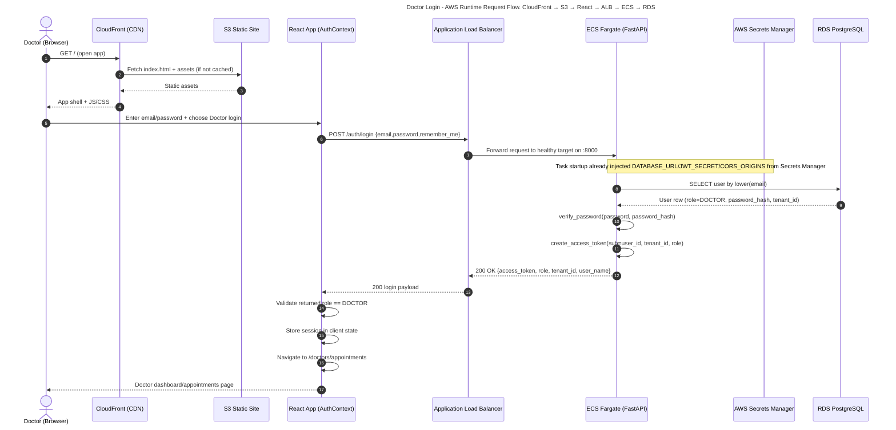

# Doctor Login Control Flow (AWS Deployment)

## Purpose
This document captures the runtime sequence for a **doctor login** in the AWS deployment created for this project.

## Scope and assumptions
- Frontend is served from **S3 + CloudFront**.
- Backend runs on **ECS Fargate** behind an **Application Load Balancer (ALB)**.
- Backend container receives `DATABASE_URL`, `JWT_SECRET`, and `CORS_ORIGINS` from **AWS Secrets Manager**.
- PostgreSQL runs on **RDS** and is reachable from ECS task security group.
- Frontend uses `VITE_API_BASE_URL` to call backend login endpoint.

## Primary sequence (successful doctor login)

## Detailed step-by-step breakdown

1. **Frontend delivery path**
   1. Browser requests the app via CloudFront.
   2. CloudFront serves cached files or fetches from S3 origin.
   3. Browser loads React bundle and initializes auth context.

2. **Doctor submits credentials**
   1. React login handler sends POST to `/auth/login` using configured API base URL.
   2. Request carries JSON body with `email`, `password`, and `remember_me`.

3. **Edge and compute routing**
   1. ALB listener forwards the request to ECS target group.
   2. ECS task receives request at FastAPI on port 8000.

4. **Backend authentication logic**
   1. FastAPI login route lowercases email and fetches user from DB.
   2. Password hash verification is performed.
   3. On success, JWT access token is generated with identity context.
   4. Response includes role and tenant metadata used by frontend.

5. **Frontend role safety check**
   1. Client verifies API-returned role matches selected login target (`DOCTOR`).
   2. On match, session is stored and doctor route is opened.
   3. On mismatch, login is rejected with generic invalid-credentials message.

## Error branches (high-level)

### A) Invalid credentials
- Backend returns `401 Invalid credentials`.
- Frontend shows authentication error and remains on login screen.

### B) Role mismatch (security gate in UI)
- Backend login succeeds but role is not `DOCTOR` while doctor tab is selected.
- Frontend blocks session establishment and shows generic invalid credentials message.

### C) CORS mismatch
- If CloudFront/frontend origin is not present in `CORS_ORIGINS`, browser blocks call.
- User sees network/CORS error at login.

### D) ECS or DB unavailable
- ALB may return 5xx if no healthy target.
- Backend may return 5xx if DB connection/query fails.

## AWS components involved in this flow
- **CloudFront**: serves frontend globally with caching.
- **S3**: stores built React assets.
- **ALB**: public API entry and traffic distribution.
- **ECS Fargate task**: hosts FastAPI API.
- **Secrets Manager**: injects runtime secrets into task environment.
- **RDS PostgreSQL**: user credential + tenant source of truth.
- **CloudWatch Logs**: captures backend container logs for troubleshooting.

## Notes for operations and observability
- Login request health depends on:
  - ALB target health (`/api/health`)
  - ECS task health check passing
  - DB reachability from ECS SG to RDS SG on 5432
- Useful telemetry during incidents:
  - ALB 4xx/5xx and target response time
  - ECS task logs in `/ecs/healthcare-backend`
  - RDS connectivity and query latency
